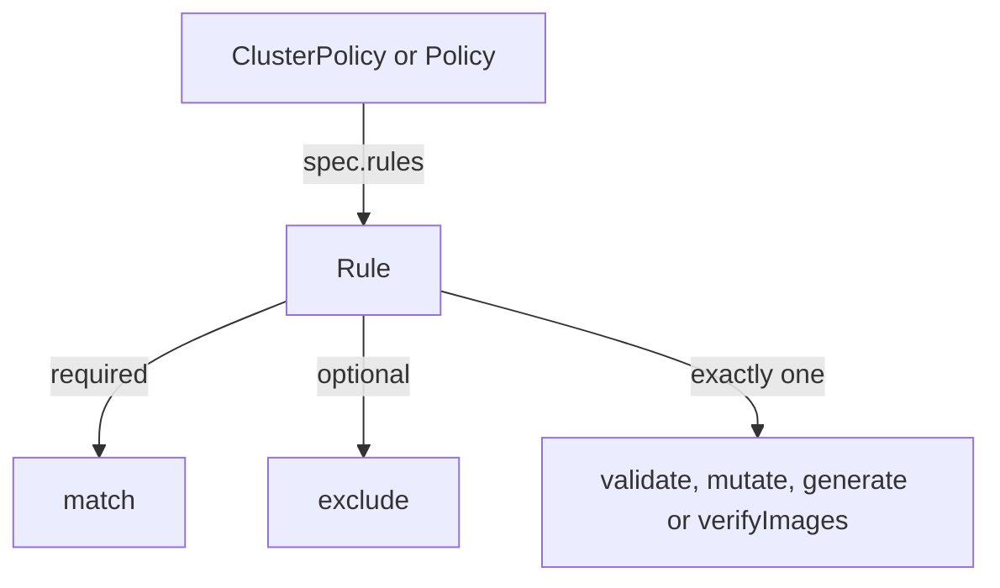

# Kyverno Policy & Rule Anatomy

Astronaut, this is your first mission with Kyverno. Kyverno is the fleet's inspection service at mission control: it checks every launch request (every new or changed Kubernetes object) against rule books you write. Most policy tools make you learn a second language first. Kyverno does not. A Kyverno policy is a normal Kubernetes object, written in the same YAML you already use for a Deployment, and applied with the same `kubectl apply`.

This module shows what a policy is made of. You meet the two policy kinds, the list of rules inside a policy, and the `match` and `exclude` blocks that decide which objects a rule may touch.

The diagram shows one rule inside a policy: it always has a `match` block, may have an `exclude` block, and has exactly one action.

## Learning objectives

After this module you can:

- Explain the difference between a `ClusterPolicy` and a `Policy`, and choose the right one for a scoping requirement.
- Find both policy kinds in the API and read the live rule schema with `kubectl api-resources` and `kubectl explain`.
- Describe the four Kyverno rule actions (`validate`, `mutate`, `generate`, `verifyImages`) and explain why one rule may only use one.
- Read and write `match` and `exclude` blocks using `resources.kinds`, `resources.namespaces` and `resources.selector`, including protecting Kyverno's own namespace.
- Explain the difference between `validationFailureAction: Audit` and `Enforce`, and say where an `Audit` result is recorded.
- Find out why a rule never fires by checking its selection against the labels that really exist on the cluster.

## Before you start

Every mission starts with a pre-flight check. Make sure you have the knowledge this module expects, and know what is waiting in your playground.

### What you should already know

- **Basic `kubectl`.** You can run `kubectl get`, `kubectl apply -f` and `kubectl describe`.
- **No Kyverno yet.** This module starts from zero.

### What is in your playground

Your playground is a training solar system: a `kind` Kubernetes cluster with `kubectl` already pointed at it. There is no SSH step. **Kyverno v1.19.1** (Helm chart 3.9.1) is installed and running in the `kyverno` namespace.

Three namespaces (planets) are ready for you to scope rules against:

| Namespace | Labels | Why it is there |
| --- | --- | --- |
| `payments` | `env=production` | Holds one running Pod, `sample-api` |
| `catalog` | `env=staging` | A second labelled planet |
| `sandbox` | none | The planet a label-based rule should skip |

The Pod `sample-api` in `payments` carries the labels `team=payments` and `app=sample-api`. No policies exist yet. Writing them is the point.

Launch your playground now, and keep it running next to you while you read the parts:

<!-- astrona:playground -->

## The parts of this module

1. [ClusterPolicy vs Policy & Rule Anatomy](./course-01-clusterpolicy-vs-policy-and-rule-anatomy.md): the two policy kinds, the shape of `spec.rules`, `Audit` versus `Enforce`, and why a rule has exactly one action.
2. [Match, Exclude & Resource Selection](./course-02-match-exclude-and-resource-selection.md): how `match` and `exclude` decide which objects a rule checks, how to confirm a selector really matches something, and your first graded mission.
3. [Wrap-Up: Mission Debrief](./course-03-wrap-up.md): what you learned, a self-check, and cleaning up the playground.

## Why this matters

Every Kyverno policy you will ever write has this same shape: a kind, a list of rules, a `match` block and one action per rule. Learn to read that shape, and any policy in any cluster becomes something you can explain line by line.
