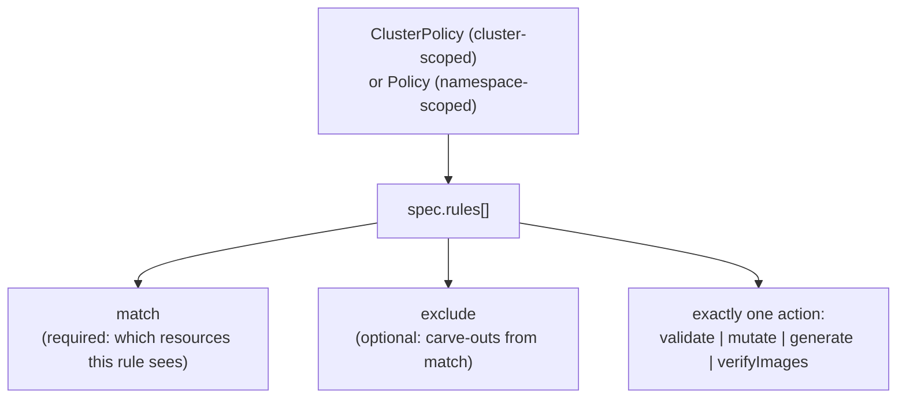

# Kyverno Policy & Rule Anatomy

<!-- astrona:playground -->
> [!NOTE]
> 🧪 **Hands-on playground for this module** — a clean, throwaway machine to explore on. No task, no grading. Folder: [`playground/`](https://github.com/astrona-io/ATS007/tree/main/sections/section-010/module-01/playground)
>
> ```sh
> astrona run --git ssh://git@github.com/astrona-io/ATS007.git -c sections/section-010/module-01/playground
> astrona destroy section-010-module-01-playground
> ```

Most policy engines make you learn a second language before you can enforce a first rule — a domain-specific expression grammar, a query language, a whole new mental model bolted onto Kubernetes. Kyverno's founding decision was to skip that entirely: a Kyverno policy is a Kubernetes custom resource, written in the same YAML you already write for a Deployment or a Service, applied with the same `kubectl apply` you already run every day.

This module is where that idea becomes concrete. You will learn the two policy resource kinds Kyverno gives you, how a policy's `rules` list is structured, and how each rule decides — precisely — which resources it is allowed to touch.



## How this module is organised

1. **[Part 1 — ClusterPolicy vs Policy & Rule Anatomy](./course-01-clusterpolicy-vs-policy-and-rule-anatomy.md)** — the two policy kinds and how to tell them apart in the API, the shape of `spec.rules`, what `validationFailureAction` costs you in `Audit` versus `Enforce`, and why a rule commits to exactly one action type.
2. **[Part 2 — Match, Exclude & Resource Selection](./course-02-match-exclude-and-resource-selection.md)** — how `match`/`exclude` decide which resources a rule actually evaluates, how to confirm a selector matches something before you trust it, and the pitfalls of getting the scope wrong.

## Learning objectives

After this module you can:

- Explain the difference between a `ClusterPolicy` and a `Policy`, and choose the right one for a given scoping requirement.
- Find both policy kinds in the API and read the live rule schema with `kubectl api-resources` and `kubectl explain`.
- Describe the four Kyverno rule action types (`validate`, `mutate`, `generate`, `verifyImages`) and explain why a single rule may only use one.
- Read and write `match` and `exclude` blocks using `resources.kinds`, `resources.namespaces`, and `resources.selector` to scope a rule precisely — including protecting Kyverno's own namespace.
- Explain the difference between `validationFailureAction: Audit` and `Enforce`, and say where an `Audit` result is recorded.
- Diagnose a rule that never fires by checking its selection against the labels actually present on the cluster.

## Before you start

You should be comfortable with basic `kubectl` usage: `kubectl get`, `kubectl apply -f`, `kubectl describe`. No prior Kyverno experience is required.

The playground linked at the top of this page gives you a kind Kubernetes cluster with `kubectl` already configured and pointed at it — there is no SSH step. Kyverno v1.13.2 is already installed and running in the `kyverno` namespace, and three namespaces are waiting for you to scope rules against: `payments` (labelled `env=production`), `catalog` (labelled `env=staging`), and `sandbox` (no labels). A single Pod, `sample-api`, is running in `payments`. No policies are pre-created — writing them is the point.

Both parts carry **Try it** checkpoints that assume that environment is already up.
