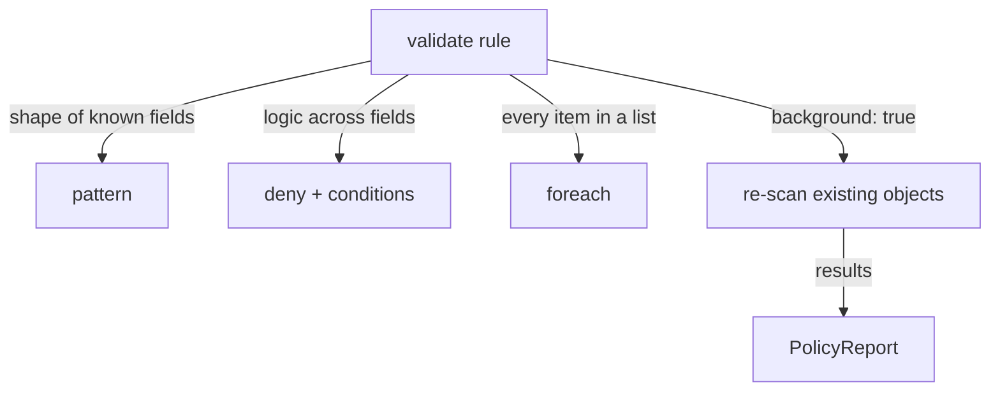

# Validate Rules: Patterns, Deny Logic & foreach

Astronaut, a `validate` rule sounds simple: approve or reject a launch request. But Kubernetes objects are nested, their lists change length, and their fields depend on each other. The simplest check, "this one field must look like this", only goes so far.

This module covers the three tools Kyverno gives you for everything past that: patterns with operators, `deny` blocks with real true-or-false conditions, and `foreach` for checking every item in a list whose length you do not know in advance. It also shows background scanning: the difference between what a policy does to an object *as it is admitted* and what it does to objects that were *already in the cluster* before the policy existed.

The diagram shows the three ways one `validate` rule can express its check, and how `background: true` sends results for existing objects to a `PolicyReport`.

## Learning objectives

After this module you can:

- Write a `validate.pattern` block using operators (`>`, `<`, `>=`, `<=`, `!`) and wildcards (`*`, `?`).
- Write a `validate.deny` block with `any` and `all` conditions to express logic a pattern cannot.
- Choose between `pattern`, `deny` and `foreach` for a given check, and explain why they are options of one rule, not separate rule types.
- Use `foreach` to check every item in a list of unknown length, such as every container in a Pod.
- Explain what `background: true` does, and read the results of a background scan from a `PolicyReport`.
- Name the Kyverno controllers that produce reports, and check them when reports do not appear.

## Before you start

Every mission starts with a pre-flight check. Make sure you have the knowledge this module expects, and know what is waiting in your playground.

### What you should already know

- **Policy structure.** A `ClusterPolicy` or `Policy` holds a list of rules under `spec.rules`. Each rule has a `match` block that picks the objects it checks, an optional `exclude` block, and one action.
- **`Enforce` and `Audit`.** `Enforce` rejects a failing object; `Audit` admits it and records the failure in a `PolicyReport`.
- **Basic `kubectl`.** `kubectl get`, `kubectl apply -f`, `kubectl run` and `-o jsonpath`.

### What is in your playground

Your playground is a training solar system: a `kind` cluster with `kubectl` already pointed at it, and no SSH step. **Kyverno v1.19.1** (Helm chart 3.9.1) is installed, and all four of its controllers are running.

Two Deployments are already flying. Both were created *before* any policy existed:

| Namespace | Deployment | Containers | Resource requests and limits |
| --- | --- | --- | --- |
| `legacy` | `legacy-reporting` | `api` and `sidecar-logger` | none on either container |
| `workloads` | `tidy-api` | `api` | both set |

No policies exist yet.

Launch your playground now, and keep it running next to you while you read the parts:

<!-- astrona:playground -->

## The parts of this module

1. [Pattern Validation & Deny Conditions](./course-01-pattern-validation-and-deny-conditions.md): the `pattern` operators and wildcards, and when you need `deny.conditions` instead.
2. [foreach & Background Scans](./course-02-foreach-and-background-scans.md): checking every item in a list, what `background: true` does to objects that already exist, which controllers produce the reports, and your graded mission.
3. [Wrap-Up: Mission Debrief](./course-03-wrap-up.md): what you learned, a self-check, and cleaning up the playground.

## Why this matters

Almost every real policy is a `validate` rule. Knowing which of the three tools fits a check, and knowing that a background scan only reports while admission can block, is what lets you roll a new rule out without surprising anyone.
