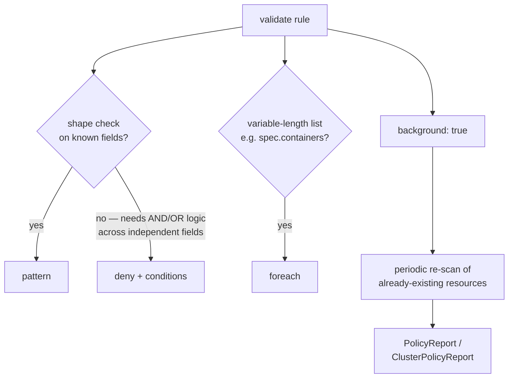

# Validate Rules: Patterns, Deny Logic & foreach

<!-- astrona:playground -->
> [!NOTE]
> 🧪 **Hands-on playground for this module** — a clean, throwaway machine to explore on. No task, no grading. Folder: [`playground/`](https://github.com/astrona-io/ATS007/tree/main/sections/section-010/module-02/playground)
>
> ```sh
> astrona run --git ssh://git@github.com/astrona-io/ATS007.git -c sections/section-010/module-02/playground
> astrona destroy section-010-module-02-playground
> ```

A `validate` rule's job sounds simple — accept or reject a resource — but Kubernetes resources are nested, variable-length, and full of fields that interact with each other. Module 1 showed you the simplest case: check that a single scalar field looks a certain way. This module covers the three mechanisms Kyverno gives you for everything past that simplest case: declarative patterns with operators, `deny` blocks with real boolean conditions, and `foreach` for validating every item in a list whose length you don't know in advance.

It also introduces background scanning properly: the difference between what a policy does to a resource *as it is admitted* and what it does to resources that were *already sitting in the cluster* before the policy existed.



## How this module is organised

1. **[Part 1 — Pattern Validation & Deny Conditions](./course-01-pattern-validation-and-deny-conditions.md)** — the three mechanisms as siblings under one `validate` block, the `pattern` operator syntax, and when you need `deny.conditions` instead.
2. **[Part 2 — foreach & Background Scans](./course-02-foreach-and-background-scans.md)** — validating every item in a list, what `background: true` actually does to resources that already exist, and which controller produces the resulting reports.

## Learning objectives

After this module you can:

- Write a `validate.pattern` block using operators (`>`, `<`, `>=`, `<=`, `!`) and wildcards (`*`, `?`).
- Write a `validate.deny` block with `any`/`all` conditions to express logic a pattern can't.
- Choose between `pattern`, `deny`, and `foreach` for a given check, and explain why they are peers rather than separate rule types.
- Use `foreach` to validate every item in a variable-length list, such as every container in a Pod.
- Explain what `background: true` does, and read the results of a background scan from a `PolicyReport`.
- Name which Kyverno controller produces report objects, and check it when reports fail to appear.

## Before you start

This module assumes you've completed Module 1, or are already comfortable with `ClusterPolicy`/`Policy` structure and `match`/`exclude`.

The playground linked at the top of this page gives you a kind Kubernetes cluster with `kubectl` already configured and pointed at it — there is no SSH step. Kyverno v1.13.2 is installed and all four of its controllers are running. Two Deployments are already in place, both created *before* any policy exists: `legacy-reporting` in the `legacy` namespace has two containers and sets no resource requests or limits on either, while `tidy-api` in `workloads` sets both. No policies are pre-created.

Both parts carry **Try it** checkpoints that assume that environment is already up.
