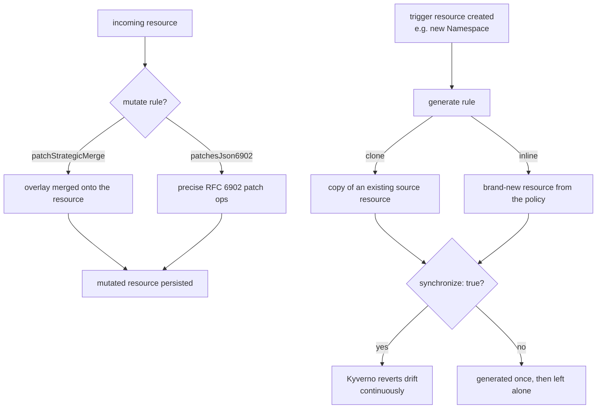

# Mutate & Generate Rules

<!-- astrona:playground -->
> [!NOTE]
> 🧪 **Hands-on playground for this module** — a clean, throwaway machine to explore on. No task, no grading. Folder: [`playground/`](https://github.com/astrona-io/ATS007/tree/main/sections/section-010/module-03/playground)
>
> ```sh
> astrona run --git ssh://git@github.com/astrona-io/ATS007.git -c sections/section-010/module-03/playground
> astrona destroy section-010-module-03-playground
> ```

Validate rules only ever say yes or no. This module covers the two Kyverno rule types that actively change the cluster on your behalf: `mutate` rules, which rewrite an incoming resource before it's persisted, and `generate` rules, which create entirely new, separate resources in response to a trigger. Together they let you enforce sane defaults and cluster-wide scaffolding without ever asking a developer to remember to add them by hand.



## How this module is organised

1. **[Part 1 — Mutate: patchStrategicMerge & patchesJson6902](./course-01-mutate-patchstrategicmerge-and-json6902.md)** — why mutation only ever sees resources on their way in, the two mutate patch styles, and when to reach for each.
2. **[Part 2 — Generate: Clone & Synchronize](./course-02-generate-clone-and-synchronize.md)** — creating and cloning resources automatically, which controller drives it, and what `synchronize` actually keeps in sync.

## Learning objectives

After this module you can:

- Write a `mutate.patchStrategicMerge` rule to add labels, annotations, or default fields to an incoming resource.
- Write a `mutate.patchesJson6902` rule for precise, array-index-aware edits a strategic merge can't express.
- Explain why a mutate rule leaves already-existing resources untouched, and name the field that changes that.
- Write a `generate` rule that creates a new resource in response to a trigger, using `clone` to copy from an existing source.
- Explain what `generate.synchronize: true` does differently from `synchronize: false`, including what happens when the policy is deleted.
- Choose between a `mutate` rule and a `validate` rule for a missing-default problem.

## Before you start

This module assumes you've completed Modules 1–2.

The playground linked at the top of this page gives you a kind Kubernetes cluster with `kubectl` already configured and pointed at it — there is no SSH step. Kyverno v1.19.1 (Helm chart 3.9.1) is installed with all four controllers running. Two things are seeded for you: a ConfigMap named `cluster-defaults` in the `platform-config` namespace, ready to be cloned, and a Pod named `existing-api` in `catalog` that was created before any policy exists. No policies are pre-created.

Both parts carry **Try it** checkpoints that assume that environment is already up.

## Where this fits

Validate rules make a cluster safe by refusing bad input; mutate and generate rules make it *usable* by removing the need for anyone to supply that input by hand. In practice the three are layered: a mutate rule fills in a sane default, a validate rule enforces the cases a default cannot cover, and a generate rule provisions the surrounding resources a workload assumes exist. Reaching for a validate rule where a mutate rule belongs is a common design mistake — it turns a problem the cluster could have silently fixed into an error message a developer has to decode.
