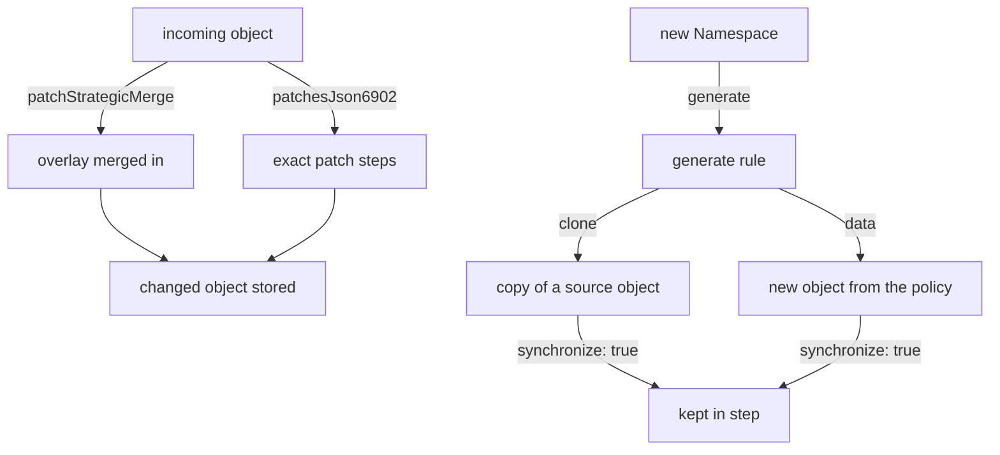

# Mutate & Generate Rules

Astronaut, validate rules only ever say yes or no. This module covers the two Kyverno rule types that change the cluster for you. `mutate` rules change an incoming object before it is stored: the ground crew adjusts the ship before launch. `generate` rules create new, separate objects when a trigger appears: a standard supply depot is built on every new planet. Together they give you sensible defaults and cluster-wide setup, without asking anyone to remember to add them by hand.

The top half shows the two ways a mutate rule changes an incoming object; the bottom half shows a generate rule creating a new object from a copy or from the policy, and keeping it in step when `synchronize` is on.

## Learning objectives

After this module you can:

- Write a `mutate.patchStrategicMerge` rule that adds labels, annotations or default fields to an incoming object.
- Write a `mutate.patchesJson6902` rule for exact, position-aware edits that a strategic merge cannot express.
- Explain why a mutate rule leaves existing objects untouched, and name the field that changes that.
- Write a `generate` rule that creates a new object when a trigger appears, using `clone` to copy an existing source.
- Explain what `generate.synchronize: true` does differently from `synchronize: false`, including what happens when the policy is deleted.
- Choose between a `mutate` rule and a `validate` rule for a missing-default problem.

## Before you start

Every mission starts with a pre-flight check. Make sure you have the knowledge this module expects, and know what is waiting in your playground.

### What you should already know

- **Policy structure.** A `ClusterPolicy` holds rules; each rule has a `match` block and exactly one action.
- **Validate rules.** A `validate` rule approves or rejects an object, and Kyverno runs all mutate rules before any validate rules.
- **Basic `kubectl`.** `kubectl get`, `kubectl apply -f`, `kubectl run` and `--show-labels`.

### What is in your playground

Your playground is a training solar system: a `kind` cluster with `kubectl` already pointed at it, and no SSH step. **Kyverno v1.19.1** (Helm chart 3.9.1) is installed with all four controllers running. Two things are ready for you:

- A ConfigMap named `cluster-defaults` in the `platform-config` namespace, ready to be cloned. It holds `log-level`, `region` and `telemetry-endpoint`.
- A Pod named `existing-api` in `catalog`, created before any policy existed.

No policies exist yet.

Launch your playground now, and keep it running next to you while you read the parts:

<!-- astrona:playground -->

## The parts of this module

1. [Mutate: patchStrategicMerge & patchesJson6902](./course-01-mutate-patchstrategicmerge-and-json6902.md): why mutation only sees objects on their way in, the two patch styles, and when to use each.
2. [Generate: Clone & Synchronize](./course-02-generate-clone-and-synchronize.md): creating and copying objects automatically, which controller does it, what `synchronize` keeps in step, and your graded mission.
3. [Wrap-Up: Mission Debrief](./course-03-wrap-up.md): what you learned, a self-check, and cleaning up the playground.

## Why this matters

Validate rules make a cluster safe by refusing bad input. Mutate and generate rules make it *usable* by removing the need for anyone to supply that input by hand. In practice the three work in layers: a mutate rule fills in a sensible default, a validate rule enforces the cases a default cannot cover, and a generate rule creates the surrounding objects a workload expects to exist.

Using a validate rule where a mutate rule belongs is a common design mistake. It turns a problem the cluster could have fixed quietly into an error message a developer has to decode.
