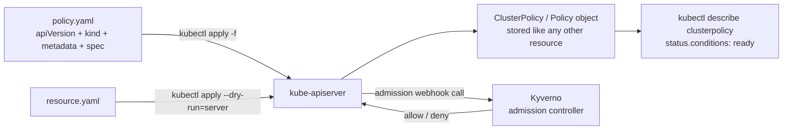

# Kyverno Policy YAML Anatomy & Applying Manifests

<!-- astrona:playground -->
> [!NOTE]
> 🧪 **Hands-on playground for this module** — a clean, throwaway machine to explore on. No task, no grading. Folder: [`playground/`](https://github.com/astrona-io/ATS007/tree/main/sections/section-020/module-01/playground)
>
> ```sh
> astrona run --git ssh://git@github.com/astrona-io/ATS007.git -c sections/section-020/module-01/playground
> astrona destroy section-020-module-01-playground
> ```



A Kyverno policy is not a special file in a special format that some separate policy engine parses on its own. It is a Kubernetes manifest — the exact same `apiVersion` / `kind` / `metadata` / `spec` shape as a Deployment or a Service — stored in etcd and served by the same `kube-apiserver` you already talk to with `kubectl`. That single design decision is why every tool you already know for managing manifests (`kubectl apply`, `kubectl get`, `kubectl diff`, GitOps controllers like Argo CD or Flux) works on Kyverno policies with zero extra tooling.

This module is about the YAML manifest itself: what the four top-level blocks contain in a Kyverno policy specifically, how to apply and inspect one with `kubectl`, and the handful of YAML-shaped mistakes (wrong indentation, wrong document count) that make a rule silently do nothing instead of failing loudly.

## How this module is organised

1. **[Part 1 — apiVersion, kind, metadata & spec](./course-01-apiversion-kind-metadata-spec.md)** — the four blocks of a Kyverno manifest, `ClusterPolicy` vs. the namespaced `Policy` kind, and the annotations that turn a policy into self-documenting output for `kubectl describe` and policy dashboards.
2. **[Part 2 — Applying & Inspecting with kubectl](./course-02-applying-and-inspecting-with-kubectl.md)** — `kubectl apply -f`, reading `status.conditions` to confirm a policy is `ready`, `kubectl apply --dry-run=server` to test a resource without creating it, and multi-document YAML files for shipping several policies together.

## Learning objectives

After this module you can:

- Identify the four top-level blocks of any Kyverno manifest and state what each one is responsible for.
- Explain the difference between `kind: ClusterPolicy` and `kind: Policy`, and when a namespaced policy is the correct choice.
- Apply a policy with `kubectl apply -f` and confirm it is active and background-scan-ready with `kubectl describe clusterpolicy`.
- Use `kubectl apply --dry-run=server` to test whether a resource would be accepted or rejected without actually creating it.
- Recognise and fix the classic Kyverno YAML bug: a `pattern` or `match` block indented one level off from where the schema expects it.

## Before you start

You should be comfortable with basic `kubectl` usage (`get`, `apply`, `describe`) and reading YAML indentation. No prior Kyverno experience is assumed.

The linked playground gives you a fresh **kind** Kubernetes cluster with Kyverno already installed and `kubectl` already pointed at it — there is no VM to log into and no SSH step. It also seeds two empty namespaces (`storefront`, `warehouse`) and two sample manifests under `/root/playground/`. Every command below runs in that environment; none of them are graded.

## Where this fits

The manifest is the only interface you get to Kyverno. There is no separate console, no policy language runtime, no CLI-only configuration — everything the engine does, from blocking a Pod to rewriting an image reference to verifying a signature, is expressed as fields inside the `spec` block of a YAML file you `kubectl apply`. That makes this module unusually load-bearing: the admission behaviour covered in Section 030 and the image verification in Section 040 are both just different `spec` contents in the same four-block envelope you learn here. It also makes one field worth flagging early — `validationFailureAction` decides whether a rule actually blocks anything or merely records that it would have. A perfectly written rule with the wrong value there enforces nothing, and nothing in the YAML looks wrong.

