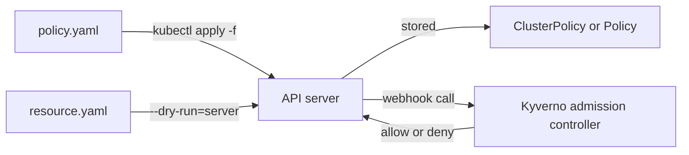

# Kyverno Policy YAML Anatomy & Applying Manifests

Astronaut, a Kyverno policy is not a special file in a special format that some separate engine reads on its own. It is a Kubernetes manifest, with the same `apiVersion`, `kind`, `metadata` and `spec` shape as a Deployment or a Service. It is stored in etcd (mission control's archive) and served by the same API server (mission control) you already talk to with `kubectl`. That is why every tool you already use for manifests, such as `kubectl apply`, `kubectl get`, `kubectl diff` and GitOps tools like Argo CD or Flux, works on Kyverno policies with no extra tooling.

This module is about the YAML manifest itself: what the four top-level blocks hold in a Kyverno policy, how to apply and inspect one with `kubectl`, and the YAML mistakes (wrong indentation, a missing document separator) that make a rule quietly do something other than what you meant.

The diagram shows a policy file stored like any other object, and a resource sent with `--dry-run=server` that the API server passes to the Kyverno admission controller for a decision.

## Learning objectives

After this module you can:

- Name the four top-level blocks of any Kyverno manifest and say what each one is for.
- Explain the difference between `kind: ClusterPolicy` and `kind: Policy`, and when a namespaced policy is the right choice.
- Apply a policy with `kubectl apply -f` and confirm it is active with `kubectl describe clusterpolicy`.
- Use `kubectl apply --dry-run=server` to test whether an object would be accepted or rejected, without creating it.
- Spot and fix the classic Kyverno YAML bug: a `pattern` or `match` block indented one level away from where the schema expects it.

## Before you start

Every mission starts with a pre-flight check. Make sure you have the knowledge this module expects, and know what is waiting in your playground.

### What you should already know

- **Basic `kubectl`.** `kubectl get`, `kubectl apply` and `kubectl describe`.
- **Reading YAML indentation.** Which field sits inside which.
- **No Kyverno experience** is needed for this module.

### What is in your playground

Your playground is a training solar system: a fresh `kind` cluster with **Kyverno v1.19.1** (Helm chart 3.9.1) installed and `kubectl` already pointed at it. There is no virtual machine to log into and no SSH step.

It also has two empty namespaces (planets), `storefront` and `warehouse`, and two sample manifests in `/root/playground/`:

- `sample-service.yaml`: a `LoadBalancer` Service named `checkout` in `storefront`.
- `sample-pod.yaml`: a Pod named `checkout` in `storefront`.

Neither file is applied to the cluster. No policies exist yet, and nothing in the playground is graded.

Launch your playground now, and keep it running next to you while you read the parts:

<!-- astrona:playground -->

## The parts of this module

1. [apiVersion, kind, metadata & spec](./course-01-apiversion-kind-metadata-spec.md): the four blocks of a Kyverno manifest, `ClusterPolicy` versus `Policy`, and the annotations that document a policy.
2. [Applying & Inspecting with kubectl](./course-02-applying-and-inspecting-with-kubectl.md): the controllers that act on a policy, `kubectl apply -f`, and reading the status to confirm a policy is ready.
3. [Dry Runs & Multi-Document Files](./course-03-dry-runs-and-multi-document-files.md): testing an object with `--dry-run=server` without creating it, shipping several policies in one file, and your graded mission.
4. [Wrap-Up: Mission Debrief](./course-04-wrap-up.md): what you learned, a self-check, and cleaning up the playground.

## Why this matters

The manifest is the only way in to Kyverno. There is no separate console and no extra policy language. Everything Kyverno does, from blocking a Pod to rewriting an image reference to checking a signature, is written as fields inside the `spec` block of a YAML file you apply with `kubectl`.

One field deserves a warning now: `validationFailureAction` decides whether a rule really blocks anything or only records that it would have. A well-written rule with the wrong value there enforces nothing, and nothing in the YAML looks wrong.
