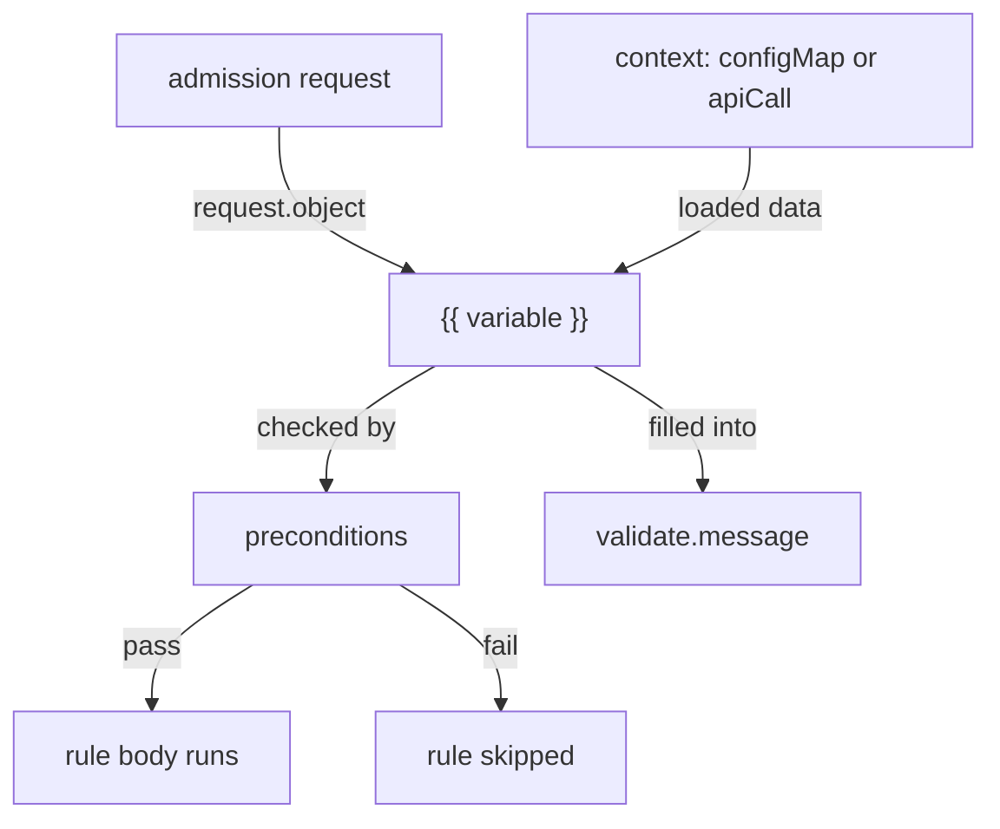

# Variables, Context & JMESPath in Kyverno YAML

Astronaut, a plain `pattern` block can only check an object against a fixed shape written into the policy. Real rules are rarely that simple. "Is this label one of the values our platform team allows right now?" needs a list that lives somewhere else and can change without editing the policy. "Does this namespace already have a cost-center label?" needs to ask the API server (mission control) a question in the middle of the check.

Kyverno handles both with **variables**: blanks in the rule, written as `{{ }}`, that are filled at check time. The text inside is a JMESPath expression, the way the inspector reads one line off a form. The data comes from the request itself or from an explicit `context` block. This module shows how to write variables, where their data comes from, and how `preconditions` use the same expressions to decide whether a rule runs at all.

The diagram shows a variable filled from the request or from a `context` entry, then used by `preconditions` to decide whether the rule runs, and in the message the user sees.

## Learning objectives

After this module you can:

- Write a `{{ }}` variable expression that reads a field from the incoming request or object.
- Explain what `context[].configMap` and `context[].apiCall` each fetch, and when to use one over the other.
- Use a `preconditions` block so a rule only applies to matching requests (for example, only on `CREATE`).
- Put a variable into `validate.message`, so a blocked user sees exactly which value broke the rule.
- Explain why an `apiCall` can return nothing even when the same `kubectl get` works for you, and where to look when it does.

## Before you start

Every mission starts with a pre-flight check. Make sure you have the knowledge this module expects, and know what is waiting in your playground.

### What you should already know

- **Basic validate rules.** You can write a `ClusterPolicy` or `Policy` with a `validate` rule, apply it with `kubectl apply -f`, and read the rejection message.
- **JSON paths help, but are not required.** If you have used dotted paths such as `metadata.labels.env`, JMESPath will feel familiar. This module starts from zero.

### What is in your playground

Your playground is a training solar system: a fresh `kind` cluster with **Kyverno v1.19.1** (Helm chart 3.9.1) installed and `kubectl` already pointed at it. There is no virtual machine and no SSH step. Every data source in this module has something real behind it:

| Object | What it holds |
| --- | --- |
| Namespace `tenant-blue` | Labels `cost-center=cc-4417` and `tier=internal` |
| Namespace `tenant-green` | No labels of its own |
| ConfigMap `deploy-settings` in `tenant-blue` | `allowed-regions: eu-north-1,eu-west-1` and `max-replicas: "5"` |
| Pod `reporting` in `tenant-blue` | Labels `env=staging` and `app=reporting` |

No policies exist yet, and nothing in the playground is graded.

Launch your playground now, and keep it running next to you while you read the parts:

<!-- astrona:playground -->

## The parts of this module

1. [Variables & JMESPath Basics](./course-01-variables-and-jmespath-basics.md): the `{{ }}` syntax, what `request.object` and `request.oldObject` hold, and your first JMESPath expressions against a real object.
2. [Context: configMap & apiCall](./course-02-context-configmap-and-apicall.md): pulling outside data into a rule with `context[].configMap` and `context[].apiCall`, and the permissions a lookup runs under.
3. [Preconditions & Allow-Lists](./course-03-preconditions-and-allow-lists.md): gating a rule with `preconditions`, combining a ConfigMap allow-list with a named rejection, and your graded mission.
4. [Wrap-Up: Mission Debrief](./course-04-wrap-up.md): what you learned, a self-check, and cleaning up the playground.

## Why this matters

Variables are what let a policy library grow without being edited every time the business changes its mind. Without them, "the allowed regions are these four" is a fact frozen into YAML. With a `context` entry, it becomes a ConfigMap a platform team owns on its own.

That power has two costs to keep in mind for every rule you write. First, a lookup that fails is silent: an expression that finds nothing usually skips the rule instead of rejecting anything, so a policy can look like it enforces and enforce nothing. Second, a `context` lookup runs as Kyverno's service account, not as you, so what you can read in a terminal is not proof of what a rule can read. Both show up as *empty results*, never as errors.
