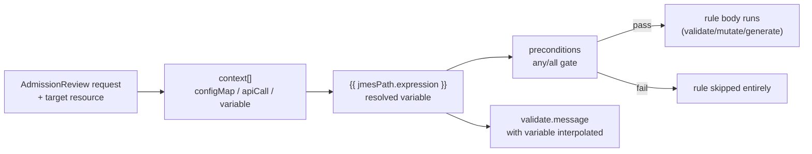

# Variables, Context & JMESPath in Kyverno YAML

<!-- astrona:playground -->
> [!NOTE]
> 🧪 **Hands-on playground for this module** — a clean, throwaway machine to explore on. No task, no grading. Folder: [`playground/`](https://github.com/astrona-io/ATS007/tree/main/sections/section-020/module-02/playground)
>
> ```sh
> astrona run --git ssh://git@github.com/astrona-io/ATS007.git -c sections/section-020/module-02/playground
> astrona destroy section-020-module-02-playground
> ```



A static `pattern` block can only ever check a resource against a fixed shape written directly into the policy. Real rules are rarely that simple — "is this label one of the values our platform team currently allows" needs a list that lives somewhere else and can change without editing the policy; "does this Namespace already have a cost-center label" needs to ask the API server a question mid-evaluation. Kyverno answers both needs with **variables**: `{{ }}`-wrapped JMESPath expressions that get resolved once, at evaluation time, against data pulled from the request itself or from an explicit `context` block.

This module covers how those variables are written and where their data comes from, and how `preconditions` use the same expression language to decide whether a rule should even run.

## How this module is organised

1. **[Part 1 — Variables & JMESPath Basics](./course-01-variables-and-jmespath-basics.md)** — the `{{ }}` syntax, what `request.object` and `request.oldObject` contain, and writing your first JMESPath expressions against a real resource.
2. **[Part 2 — Context: configMap & apiCall](./course-02-context-configmap-and-apicall.md)** — pulling external data into a rule with `context[].configMap` and `context[].apiCall`, and gating a rule with `preconditions`.

## Learning objectives

After this module you can:

- Write a `{{ }}` variable expression that reads a field off the incoming request or resource.
- Explain what `context[].configMap` and `context[].apiCall` each fetch, and when to reach for one over the other.
- Use a `preconditions` block to make a rule apply only to matching requests (e.g. only on `CREATE`).
- Interpolate a variable into `validate.message` so a blocked user sees exactly which value tripped the rule.
- Explain why an `apiCall` can return nothing even when the equivalent `kubectl get` works for you, and where to look when it does.

## Before you start

Complete Module 1 first — this module assumes you can already write and apply a basic `validate` rule. Familiarity with JSON path-style lookups (e.g. `dot.notation.access`) is helpful but not required; JMESPath is introduced from first principles.

The linked playground gives you a fresh **kind** Kubernetes cluster with Kyverno already installed and `kubectl` already pointed at it — no VM, no SSH step. It is seeded so that every data source in this module has something real behind it: a labelled namespace `tenant-blue`, an unlabelled `tenant-green`, a `deploy-settings` ConfigMap, and a running Pod at `tenant-blue/reporting`. Nothing in these parts is graded.

## Where this fits

Variables are what separate a policy library that scales from one that has to be edited every time the business changes its mind. Without them, "the allowed regions are these four" is a fact frozen into YAML; with a `context` entry it becomes a ConfigMap a platform team owns independently. That leverage comes with two costs worth carrying into every rule you write from here on. First, resolution is silent on failure — an expression that finds nothing usually skips the rule rather than rejecting anything, so a policy can look enforcing and enforce nothing. Second, a `context` lookup runs as Kyverno's service account, not as you, so what you can read in a terminal is not the test for what a rule can read at evaluation time. Both surface as *empty results*, never as errors, which is why this module keeps returning to the lookup that finds nothing.
