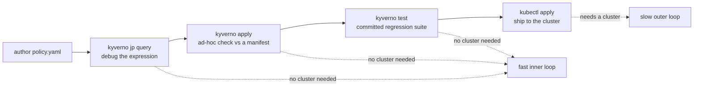

# Validating Manifests with the Kyverno CLI

<!-- astrona:playground -->
> [!NOTE]
> 🧪 **Hands-on playground for this module** — a clean, throwaway machine to explore on. No task, no grading. Folder: [`playground/`](https://github.com/astrona-io/ATS007/tree/main/sections/section-020/module-03/playground)
>
> ```sh
> astrona run --git ssh://git@github.com/astrona-io/ATS007.git -c sections/section-020/module-03/playground
> astrona destroy section-020-module-03-playground
> ```



Everything you have written so far in this section has been proven the same way: apply the policy to a live cluster, create a resource, and see whether it was blocked. That works, but it is a slow way to find out that a `pattern` block was nested one level too shallow. Each iteration costs a `kubectl apply`, a test resource, a cleanup, and a cluster that has to be running in the first place.

The `kyverno` CLI removes the cluster from that loop. It is a standalone binary that embeds the same policy engine the in-cluster controllers run, so it can evaluate a policy against a resource manifest entirely on your laptop — no cluster, no admission webhook, no `kubectl` context. That makes it the right tool for the tight authoring loop, and, because it exits non-zero when a policy fails, the right tool for a CI gate that blocks a pull request before a bad policy ever reaches a cluster.

This module covers the three subcommands that matter for manifest validation: `apply` for one-off evaluation, `test` for a declarative regression suite, and `jp` for debugging the JMESPath expressions Module 2 introduced.

## How this module is organised

1. **[Part 1 — `kyverno apply`: Offline Evaluation](./course-01-kyverno-apply-offline-evaluation.md)** — installing the CLI, running a policy against one or more resource manifests with no cluster attached, supplying the variables a policy expects, and reading the exit code as a CI signal.
2. **[Part 2 — `kyverno test` Suites & `jp`](./course-02-kyverno-test-suites-and-jp.md)** — writing a `kyverno-test.yaml` that declares expected outcomes so a policy library can be regression-tested, and using `kyverno jp` to iterate on a JMESPath expression before it ever goes into a rule.

## Learning objectives

After this module you can:

- Install the `kyverno` CLI and explain how it relates to the in-cluster controllers.
- Evaluate a policy against a resource manifest offline with `kyverno apply`, including supplying variable values with `--set` or `--values-file`.
- Explain why `kyverno apply`'s exit code makes it usable as a CI gate.
- Write a `kyverno-test.yaml` suite declaring `policies`, `resources`, and expected `results`, and run it with `kyverno test`.
- Articulate when to reach for `apply` versus `test`, and why they are not interchangeable.
- Debug a JMESPath expression against a JSON input with `kyverno jp query` before wiring it into a rule.

## Before you start

Complete Modules 1 and 2 first. This module assumes you can already write a `validate` rule and read a `{{ }}` variable expression — `kyverno jp` in particular only makes sense as a debugging tool for the JMESPath syntax [Module 2](../module-02/course.md) taught.

The linked playground gives you a fresh **kind** Kubernetes cluster with Kyverno installed in-cluster, the `kyverno` CLI installed on the node, and `kubectl` already pointed at the cluster — no VM, no SSH step. It also seeds a sample policy, a passing and a failing Pod manifest, and a JSON document under `/root/playground/`. Most of what follows never touches the cluster at all — that is the point.
