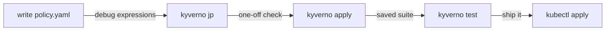

# Validating Manifests with the Kyverno CLI

Astronaut, so far there has been one way to prove a policy works: apply it to a live cluster, create an object, and see whether it was blocked. That works, but it is a slow way to find out that a `pattern` block was nested one level too shallow. Every try costs a `kubectl apply`, a test object, a cleanup, and a cluster that has to be running in the first place.

The `kyverno` command-line tool (CLI, command-line interface) takes the cluster out of that loop. It is a standalone program that carries the same policy engine the in-cluster controllers run. So it can check a policy against a manifest entirely on your machine: no cluster, no admission webhook, no `kubectl` context. Think of it as a ground drill: the rule book runs against ship plans, with no solar system needed. It is the right tool for fast policy writing, and, because it exits with an error code when a policy fails, the right tool for an automated check that blocks a pull request before a bad policy reaches a cluster.

The diagram shows the usual order: debug expressions, check one manifest, write a saved test suite, and only then apply the policy to a cluster. Only the last step needs a cluster.

## Learning objectives

After this module you can:

- Install the `kyverno` tool and explain how it relates to the in-cluster controllers.
- Check a policy against a manifest offline with `kyverno apply`, including giving variable values with `--set` or `--values-file`.
- Explain why the exit code of `kyverno apply` makes it usable as an automated pipeline check.
- Write a `kyverno-test.yaml` suite with `policies`, `resources` and expected `results`, and run it with `kyverno test`.
- Explain when to use `apply` and when to use `test`, and why they are not the same.
- Debug a JMESPath expression against a JSON input with `kyverno jp query` before putting it into a rule.

## Before you start

Every mission starts with a pre-flight check. Make sure you have the knowledge this module expects, and know what is waiting in your playground.

### What you should already know

- **Validate rules.** You can write a `validate` rule with a `pattern`.
- **Variables.** A `{{ }}` variable holds a JMESPath expression that reads a field, such as `request.object.metadata.labels.team`.

### What is in your playground

Your playground is a training solar system: a fresh `kind` cluster with **Kyverno v1.19.1** (Helm chart 3.9.1) installed and `kubectl` already pointed at it. There is no virtual machine and no SSH step. The **`kyverno` tool v1.19.1** is installed at `/usr/local/bin/kyverno`.

Sample files are waiting in `/root/playground/`:

| File | What it is |
| --- | --- |
| `disallow-latest-tag.yaml` | A `ClusterPolicy` with the rule `require-explicit-tag`, which rejects `:latest` images |
| `pinned-pod.yaml` | A Pod named `pinned-pod` using `nginx:1.27`: it should pass |
| `latest-pod.yaml` | A Pod named `latest-pod` using `nginx:latest`: it should fail |
| `sample.json` | A small JSON document for practising `kyverno jp query` |

No test suite is created for you, and nothing is applied to the cluster. Most of this module never touches the cluster at all; that is the point.

Launch your playground now, and keep it running next to you while you read the parts:

<!-- astrona:playground -->

## The parts of this module

1. [The Kyverno Command-Line Tool](./course-01-the-kyverno-command-line-tool.md): what the tool is, how to install it, and why its version must match the cluster's.
2. [kyverno apply: Offline Evaluation](./course-02-kyverno-apply-offline-evaluation.md): checking a policy against one or more manifests with no cluster, supplying variables, and reading the exit code.
3. [kyverno test Suites & jp](./course-03-kyverno-test-suites-and-jp.md): writing a `kyverno-test.yaml` that declares expected results, debugging expressions with `kyverno jp`, and your graded mission.
4. [Wrap-Up: Mission Debrief](./course-04-wrap-up.md): what you learned, a self-check, and cleaning up the playground.

## Why this matters

A policy library grows, and every change can break a rule that used to work. A saved test suite that runs in seconds, with no cluster, is how you catch that before the cluster does.
