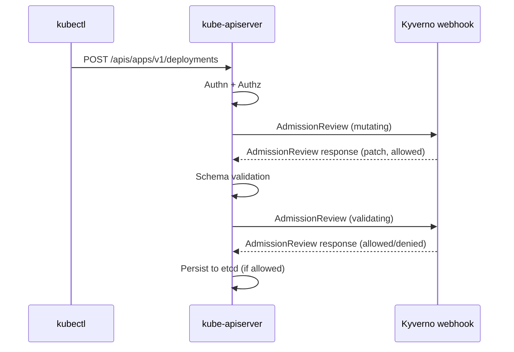

# Part 1 — The API Request Lifecycle & Webhook Types

> Prerequisite: [Landing page](./course.md). Next: [Part 2 — Mutating vs Validating Webhooks](./course-02-mutating-vs-validating-webhooks.md).

When you run `kubectl apply -f deployment.yaml`, it feels instantaneous and singular — one call, one result. Underneath, the API server runs that request through a strict, ordered pipeline before anything is written to etcd. Every stage in that pipeline can reject the request outright, and two of the stages can also rewrite the object in flight.

## The ordered pipeline

For any write request (create, update, delete, connect), the API server runs, in this exact order:

1. **Authentication** — who is making this request? Client certificates, bearer tokens, and OIDC identity are checked here. An unauthenticated request is rejected immediately.
2. **Authorization** — is this identity allowed to perform this verb on this resource? RBAC (`Role`/`ClusterRole` bindings) is evaluated here. An unauthorized request never reaches admission control at all.
3. **Mutating admission** — the object may still be rewritten. Both built-in mutating controllers and any registered `MutatingWebhookConfiguration` webhooks run here, in sequence. This is the *only* stage where the object can legally change shape.
4. **Object schema validation** — the (possibly mutated) object is checked against the resource's OpenAPI schema. A required field that's still missing after mutation fails here, before any validating webhook is even called.
5. **Validating admission** — built-in validating controllers and any registered `ValidatingWebhookConfiguration` webhooks run here. Every registered webhook of this stage sees the *same*, fully-mutated object; none of them may modify it, only allow or deny.
6. **Persistence** — if every prior stage allowed the request, the object is written to etcd.

The ordering matters for one non-obvious reason: **mutation always finishes completely before validation starts**. A validating webhook never sees a partially-mutated object — it sees the final shape after every mutating webhook has had its turn. This is exactly why Kyverno's `mutate` rules and `validate` rules can cooperate: a mutate rule can inject a missing label, and a validate rule further down the pipeline sees that label already present and passes.

The two webhook stages are not hard-coded behaviour hidden inside the API server — each is backed by a registrable API type that any cluster administrator can create objects of.

> [!TIP]
> **Try it — confirm the two webhook stages are real API types**
>
> ```sh
> kubectl api-resources | grep -i webhookconfiguration
> ```
>
> Expect something like:
>
> ```text
> mutatingwebhookconfigurations      admissionregistration.k8s.io/v1   false   MutatingWebhookConfiguration
> validatingwebhookconfigurations    admissionregistration.k8s.io/v1   false   ValidatingWebhookConfiguration
> ```
>
> One API type per mutating/validating stage, both cluster-scoped. Stages 3 and 5 above are extensible precisely because these types exist — everything that follows in this module is about the objects you create from them.

## The pipeline has real, inspectable participants

Knowing the types exist is not the same as seeing who has registered with them. A `ValidatingWebhookConfiguration` object is a record telling the API server *"during the validating stage, for these resource kinds, POST the request to this HTTPS endpoint and honour the answer."* A `MutatingWebhookConfiguration` says the same for the mutating stage.

Kyverno registers several of each when it installs — separate configurations for policing ordinary resources, for policing Kyverno's own policy objects, and for its cleanup features.

> [!TIP]
> **Try it — list the webhook registrations Kyverno created**
>
> ```sh
> kubectl get validatingwebhookconfigurations,mutatingwebhookconfigurations
> ```
>
> Expect something like:
>
> ```text
> NAME                                                              WEBHOOKS   AGE
> validatingwebhookconfiguration.../kyverno-policy-validating-webhook-cfg     1          4m
> validatingwebhookconfiguration.../kyverno-resource-validating-webhook-cfg   2          4m
> mutatingwebhookconfiguration.../kyverno-policy-mutating-webhook-cfg         1          4m
> mutatingwebhookconfiguration.../kyverno-resource-mutating-webhook-cfg       2          4m
> ```
>
> The exact set of configurations and their `WEBHOOKS` counts vary by Kyverno version — what matters is that both families are present and owned by Kyverno. These objects are the concrete form of the mutating and validating stages listed above.

## Built-in controllers vs dynamic webhooks

Not every admission controller is a webhook. Kubernetes ships with a set of **built-in admission controllers** compiled directly into `kube-apiserver` and enabled by flag — `NamespaceLifecycle` (blocks creating objects in a terminating namespace), `LimitRanger` (applies default resource requests/limits), `ResourceQuota` (enforces namespace-level quotas), and others. They are fast, always available, in-process code, and cannot be extended by an administrator beyond their built-in behavior without reconfiguring or rebuilding the API server.

**Dynamic admission webhooks** are the extension point — and the bridge between the two worlds is itself a pair of built-in controllers. `MutatingAdmissionWebhook` and `ValidatingAdmissionWebhook` are compiled into the API server like the rest, but they do nothing on their own: they read the webhook configuration objects you just listed and call out over HTTPS to whatever those objects name. That indirection is the only reason a program like Kyverno — written independently, installed with `kubectl`, upgraded on its own schedule — can participate in the request path at all.

For every matching request, the API server serializes the request into an `AdmissionReview` object, POSTs it to the registered endpoint, and waits for an `AdmissionReview` response telling it whether to allow the request — and, for a mutating webhook, an optional JSON patch to apply.

Kyverno is exactly this: a workload running in the `kyverno` namespace, fronted by a `Service`, registered as both webhook types. It has no special access to the API server's internals — from the API server's point of view, Kyverno is just another webhook endpoint being called over HTTPS like any other.

> [!TIP]
> **Try it — find the API server's compiled-in plugin flag**
>
> ```sh
> kubectl -n kube-system get pod -l component=kube-apiserver \
>   -o jsonpath='{.items[0].spec.containers[0].command}' | tr ',' '\n' | grep -i admission
> ```
>
> Expect something like:
>
> ```text
> "--enable-admission-plugins=NodeRestriction"
> ```
>
> Read this flag carefully: it lists plugins enabled *in addition to* the large default set, so a short list does not mean few controllers are running. The point is the contrast — this list is fixed at API server startup, while the webhook configurations from the previous checkpoint can be created, edited, and deleted at runtime by anyone with permission.



> [!WARNING]
> **Common pitfalls**
>
> - **Assuming a validating webhook can still adjust the object.** It cannot. By the time the validating stage runs, mutation is over — a validating webhook's answer is limited to allow or deny. If a policy needs to *change* a resource, it has to be a mutate rule, which runs in the earlier stage.
> - **Debugging the validate rule when the mutate rule is at fault.** Because a validating webhook is called *after* schema validation and *after* every mutating webhook has run, a Kyverno `validate` rule that checks for a field your `mutate` rule is supposed to inject only works if that mutate rule ran without error. If the mutate rule silently fails to apply (a typo in the JSON path, for instance), the validate rule downstream sees the original, unmutated object and rejects it — the first visible symptom of a broken mutate rule is often a confusing validate failure.

> *The pipeline's order is the whole contract: mutation finishes, then the schema is checked, then validation gets a final yes-or-no on an object nobody may touch again.*

## Reference

- `kubectl explain mutatingwebhookconfiguration.webhooks` / `kubectl explain validatingwebhookconfiguration.webhooks` — the full field list this part only summarizes.
- Kubernetes documentation: "Dynamic Admission Control" — the canonical description of the `AdmissionReview` request/response contract.
