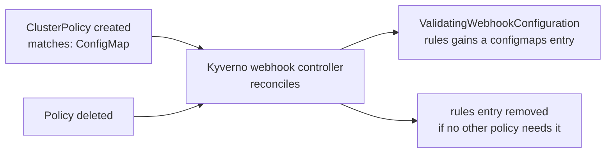

# Part 2 — Mutating vs Validating Webhooks

> Prerequisite: [Part 1 — The API Request Lifecycle & Webhook Types](./course-01-api-request-lifecycle-and-webhook-types.md). Landing page: [course.md](./course.md).

Registering a webhook is not "intercept everything" — a `MutatingWebhookConfiguration` or `ValidatingWebhookConfiguration` object carries a set of fields that precisely scope when the API server bothers to call it, and what happens if that call fails. Kyverno manages one of each, and understanding these fields is what makes the difference between "Kyverno enforces my policy" and "Kyverno was never even asked."

## Kyverno is the program on the other end of the call

A webhook configuration only names an endpoint; something has to be listening there. In Kyverno's case that something is a set of Deployments in the `kyverno` namespace. The one that actually answers admission calls is `kyverno-admission-controller` — the others handle background work you will meet in Module 2.

This has a direct operational consequence, and it is why the next section matters: if those pods are unhealthy, the API server's calls fail, and what happens to the blocked request is decided entirely by a single field on the webhook object.

> [!TIP]
> **Try it — see who is serving the webhook endpoint**
>
> ```sh
> kubectl get deployments -n kyverno
> ```
>
> Expect something like:
>
> ```text
> NAME                          READY   UP-TO-DATE   AVAILABLE   AGE
> kyverno-admission-controller  1/1     1            1           5m
> kyverno-background-controller 1/1     1            1           5m
> kyverno-cleanup-controller    1/1     1            1           5m
> kyverno-reports-controller    1/1     1            1           5m
> ```
>
> Replica counts and ages vary with the install and how long the cluster has been up. `kyverno-admission-controller` is the process the API server contacts during admission; the request path depends on it being `AVAILABLE`.

## The fields that shape a webhook

- **`rules`** — a list of `{apiGroups, apiVersions, resources, operations}` matchers. Only requests matching at least one rule entry are sent to this webhook at all. A webhook with no rule entry for `configmaps` is never called for a ConfigMap write, no matter what policies exist logically "about" ConfigMaps elsewhere.
- **`failurePolicy`** — what happens if the webhook cannot be reached, times out, or returns an error:
  - `Ignore` — **fail-open**. The request is admitted as if the webhook had said yes. Availability is protected; policy enforcement is not guaranteed during an outage.
  - `Fail` — **fail-closed**. The request is rejected. Policy enforcement is guaranteed; but if the webhook's pods are down, *every* matching request cluster-wide is blocked, including ones with no active policy concern.
- **`namespaceSelector`** / **`objectSelector`** — label selectors that scope which namespaces or objects the webhook is even called for, independent of `rules`. This is how you exempt system namespaces like `kube-system` from a webhook without editing every policy.
- **`sideEffects`** — declares whether calling the webhook has side effects outside the admission request itself (almost always `None` for policy engines like Kyverno).
- **`matchPolicy`** — `Exact` or `Equivalent`; whether the webhook should also be called for older API versions of a resource that are equivalent to a newer one it registered for.
- **`timeoutSeconds`** — how long the API server waits for a response before treating the call as failed (subject to `failurePolicy`).

> [!TIP]
> **Try it — read a live webhook rule entry**
>
> ```sh
> kubectl get validatingwebhookconfigurations kyverno-resource-validating-webhook-cfg -o yaml | head -n 40
> ```
>
> Expect something like:
>
> ```text
> webhooks:
> - name: validate.kyverno.svc-fail
>   failurePolicy: Fail
>   sideEffects: None
>   rules:
>   - apiGroups: [""]
>     apiVersions: ["v1"]
>     resources: ["configmaps"]
>     operations: ["CREATE", "UPDATE"]
>   namespaceSelector:
>     matchExpressions:
>     - key: kubernetes.io/metadata.name
>       operator: NotIn
>       values: ["kube-system", "kyverno"]
> ```
>
> The exact webhook name and rule count depend on which policies exist right now — that is the subject of the next section.

## Kyverno's self-managing webhook

A naive policy engine would register one static webhook rule for "every resource, every operation" the moment it installs, whether or not any policy actually cares about most of those kinds. That maximizes latency risk on every single API request in the cluster.

Kyverno does the opposite: its webhook configuration controller watches every `ClusterPolicy` and `Policy` in the cluster and continuously **rewrites its own `MutatingWebhookConfiguration`/`ValidatingWebhookConfiguration` `rules`** to be the union of exactly the resource kinds referenced by currently installed policies. Install a policy that only matches `Pod`, and Kyverno's webhook grows a `pods` rule entry (if one wasn't already there from another policy). Delete every policy that mentions `Pod`, and that rule entry disappears again. Resource kinds no policy cares about never generate a webhook call in the first place.



This is the concrete, observable mechanism behind a sentence you'll see often in Kyverno's own docs: "Kyverno only intercepts what you tell it to care about." It is not a marketing claim — it is this reconciliation loop, and the playground is set up to let you see one end of it directly, because it starts with no policies at all.

> [!TIP]
> **Try it — confirm the cluster is policy-free, then count webhook rules**
>
> ```sh
> kubectl get clusterpolicies
> kubectl get validatingwebhookconfigurations kyverno-resource-validating-webhook-cfg \
>   -o jsonpath='{.webhooks[*].rules}{"\n"}'
> ```
>
> Expect something like:
>
> ```text
> No resources found
> [{"apiGroups":[""],"apiVersions":["v1"],"operations":["CREATE","UPDATE"],"resources":[]}]
> ```
>
> With no policies installed, the resource webhook has nothing to intercept, so its `resources` list is empty (some versions omit the rule entirely). Install a policy that matches a kind and this list grows to include it — that is the reconciliation loop above, observed from the empty end.

> [!WARNING]
> **Common pitfalls**
>
> - **Treating `failurePolicy: Ignore` as the obviously safe setting.** It is safe for cluster *availability* and unsafe for *enforcement*: while the webhook is unreachable, matching requests sail through unchecked. `Fail` inverts both. Neither is universally correct; the right choice depends on whether an outage should stop deployments or stop enforcement.
> - **Hand-editing Kyverno's webhook configuration and expecting the edit to stick.** Kyverno's controller reconciles those objects continuously and will overwrite manual changes to its managed `rules`. Configure the behaviour through Kyverno's own settings instead of patching the generated object.
> - **Assuming reconciliation is instantaneous.** Right after `kubectl apply -f policy.yaml`, the webhook rule may not have caught up. If you re-read the webhook object in the same second and don't see your resource kind yet, wait a few seconds before assuming the policy is broken — the policy object and the webhook rule are two separate resources reconciled by two separate controllers.

> *A policy only takes effect if the API server was configured to call Kyverno for that kind — and Kyverno writes that configuration itself, from the policies you installed.*

## Reference

- `kubectl explain mutatingwebhookconfiguration.webhooks.failurePolicy` — the field's full documentation string from the installed API server.
- Kyverno documentation: "Applying Policies" and "Webhook configuration" — how `webhookConfiguration` in the Kyverno install chart can further tune `failurePolicy`, `timeoutSeconds`, and namespace exclusions cluster-wide.
