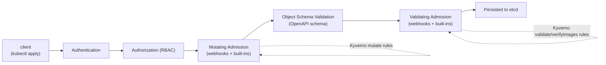

# The Kubernetes Admission Control Model

<!-- astrona:playground -->
> [!NOTE]
> 🧪 **Hands-on playground for this module** — a clean, throwaway machine to explore on. No task, no grading. Folder: [`playground/`](https://github.com/astrona-io/ATS007/tree/main/sections/section-030/module-01/playground)
>
> ```sh
> astrona run --git ssh://git@github.com/astrona-io/ATS007.git -c sections/section-030/module-01/playground
> astrona destroy section-030-module-01-playground
> ```

Every object that lands in etcd — a Pod, a ConfigMap, a Deployment — passed through a gauntlet first. The API server does not just write what you send it; it runs the request through a pipeline of checks, and one stage of that pipeline is where Kyverno lives. Understanding that pipeline is the foundation for understanding everything Kyverno does, because Kyverno is not a background scanner bolted onto Kubernetes — it is a participant *inside* the request path itself.

This module builds the mental model of that pipeline from the ground up: what happens between `kubectl apply` and an object existing in etcd, the two families of admission controller Kubernetes ships with, and the webhook mechanism that lets an external program like Kyverno insert itself into that flow.



## How this module is organised

1. **[Part 1 — The API Request Lifecycle & Webhook Types](./course-01-api-request-lifecycle-and-webhook-types.md)** — the exact ordered stages a write request passes through, the difference between a built-in controller and a dynamic webhook, and how to see Kyverno's registrations as real objects in the cluster.
2. **[Part 2 — Mutating vs Validating Webhooks](./course-02-mutating-vs-validating-webhooks.md)** — who serves the endpoint, the fields that shape a webhook's behavior (`rules`, `failurePolicy`, `namespaceSelector`, `timeoutSeconds`), and how Kyverno dynamically manages its own webhook configuration as policies come and go.

## Learning objectives

After this module you can:

- Recite the ordered stages of the Kubernetes API request lifecycle for a write, and state which stages mutation is legal in and which stages are validation-only.
- Explain the difference between a built-in admission controller compiled into `kube-apiserver` and a dynamic admission webhook served by an external program.
- Identify which Kyverno Deployment answers admission calls, and explain what happens to a matching request when it is unavailable.
- Read a `MutatingWebhookConfiguration`/`ValidatingWebhookConfiguration` object and explain what `rules`, `failurePolicy`, `namespaceSelector`, and `timeoutSeconds` each control.
- Explain the fail-open vs fail-closed tradeoff between `failurePolicy: Ignore` and `failurePolicy: Fail`.
- Explain how Kyverno keeps its own webhook `rules` in sync with the resource kinds referenced by currently installed policies, and inspect that live configuration with `kubectl`.

## Before you start

You should be comfortable with basic `kubectl` usage (`get`, `apply`, `describe`) and know what a Kubernetes CRD is in general terms. No prior admission-control or Kyverno experience is assumed.

The linked playground gives you a fresh **kind** Kubernetes cluster with Kyverno already installed and `kubectl` already pointed at it — there is no VM and no SSH step. It deliberately starts with **zero policies installed**, which matters for this module: several checkpoints in the parts below are only meaningful on a cluster where you control exactly which policies exist. Every command in both parts runs against that cluster.

## Where this fits

Admission control is the foundation the rest of this course sits on. Every Kyverno feature you will meet later — validate rules that reject a Pod, mutate rules that rewrite one, `verifyImages` rules that check a signature — is ultimately a callback the API server makes during one of the two admission stages above. Policy authors who skip this model tend to hit the same wall: they write a correct policy, it never fires, and they debug the policy for an hour when the real answer is that the API server was never configured to call Kyverno for that resource kind in the first place. Knowing where the callback happens tells you where to look when nothing happens.
