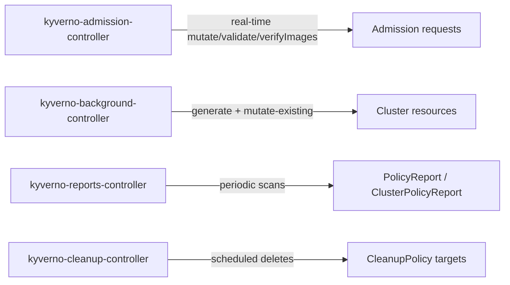

# Part 2 — Background Scanning & Controllers

> Prerequisite: [Part 1 — Enforce vs Audit & PolicyReports](./course-01-enforce-vs-audit-and-policyreports.md). Landing page: [course.md](./course.md).

Admission control only ever sees a resource at the moment it is created or updated. A Deployment that already existed in the cluster a year before your new policy was installed will never pass through that policy's webhook again on its own — nothing about it is being created or updated. Without another mechanism, that old Deployment would silently escape every new policy you write.

## The violation that was already there

Part 1's report named a specific resource, and it is worth looking at directly, because it is the situation that makes this whole mechanism necessary. The playground's `analytics` namespace contains a Deployment called `legacy-etl` that carries no `cost-center` label. It was created *before* any policy existed, and it is running right now.

Admission control cannot help you here, and not because of a configuration mistake. Admission webhooks are only consulted when a resource is being created or updated. Nothing is creating or updating `legacy-etl` — it is simply sitting there. A policy you install this afternoon will never see it pass through the webhook at all.

> [!TIP]
> **Try it — find the workload that predates every policy**
>
> ```sh
> kubectl get deployments -n analytics --show-labels
> ```
>
> Expect something like:
>
> ```text
> NAME         READY   UP-TO-DATE   AVAILABLE   AGE   LABELS
> legacy-etl   1/1     1            1           6m    app=legacy-etl
> ```
>
> Note what is *absent*: there is no `cost-center` label. Ages and the exact label set vary. This is the resource Part 1's `fail` result entry was pointing at.

## Background scanning closes that gap

Setting `background: true` on a policy (the default for `validate` rules) tells Kyverno to periodically re-evaluate *existing* resources against the rule, independent of admission events, and record the results as `PolicyReport`/`ClusterPolicyReport` entries. This is what let `legacy-etl` show up in a report in Part 1 even though nobody re-applied it after the policy was installed.

Background scanning only ever produces **report entries** — it cannot retroactively block or delete a resource that already exists and violates a policy that is now `Enforce`. Enforce mode only stops *new* violations at the door; background scanning is how you find violations that got in before the door existed.

Because the behaviour depends entirely on that one field, it is the first thing to check when a long-running resource is missing from a report.

> [!TIP]
> **Try it — confirm a policy is set to scan existing resources**
>
> ```sh
> kubectl get clusterpolicy require-cost-center-label -o jsonpath='{.spec.background}{"\n"}'
> ```
>
> Expect `true`. If a policy needs to skip background scanning entirely (some `mutate`/`generate` rules depend on live admission-request context that isn't available during a background pass), you will see `false` here instead — and its report will only ever cover resources admitted since it was installed.

## The four controllers

Since Kyverno 1.10 (the "chainsaw" architecture split), what used to be one monolithic pod is four separate controllers, each running in the `kyverno` namespace with its own `Deployment`. Knowing which one does what matters directly for troubleshooting:

| Controller | Responsible for |
| --- | --- |
| `kyverno-admission-controller` | Serves the `MutatingWebhookConfiguration`/`ValidatingWebhookConfiguration` HTTPS endpoints. Handles real-time `mutate`, `validate`, and `verifyImages` rule evaluation at admission time. |
| `kyverno-background-controller` | Drives `generate` rule processing and mutate-existing (`mutateExistingOnPolicyUpdate`) background work. |
| `kyverno-reports-controller` | Runs the periodic background scans described above and writes/aggregates `PolicyReport`/`ClusterPolicyReport` objects. |
| `kyverno-cleanup-controller` | Executes `CleanupPolicy`/`ClusterCleanupPolicy` TTL-based deletion of matching resources on a schedule. |



This split has a concrete consequence for the report you read in Part 1: it was not written by the admission controller. The admission controller was never involved at all, because `legacy-etl` was never re-admitted. The report came from `kyverno-reports-controller`.

That distinction is the whole troubleshooting heuristic. A missing report for a long-running resource is a reports-controller question; a resource that should have been blocked but was not is an admission-controller question. Reading the wrong component's logs is the most common way to waste an hour here.

> [!TIP]
> **Try it — identify the controller that produced the report**
>
> ```sh
> kubectl get deployment -n kyverno kyverno-reports-controller
> ```
>
> Expect something like:
>
> ```text
> NAME                         READY   UP-TO-DATE   AVAILABLE   AGE
> kyverno-reports-controller   1/1     1            1           8m
> ```
>
> If reports ever stop appearing for existing resources, this is the Deployment whose health and logs are relevant — `kubectl logs -n kyverno deployment/kyverno-reports-controller`. Ages and replica counts vary with the install.

> [!WARNING]
> **Common pitfalls**
>
> - **Debugging a missing report in the admission controller's logs.** For a resource that has existed for weeks, the admission controller has no record of it and never will — the resource was never re-admitted. Missing background-scan results point at `kyverno-reports-controller`, or at a policy with `background: false`.
> - **Expecting background scanning to fix anything.** It reports; it does not block, evict, patch, or delete. Finding the violation is automatic, remediating it is not.
> - **Assuming a report appears the instant a policy is applied.** Background scans run on an interval, not on a trigger. A report that is not there yet is frequently just a report that is not there *yet*.

> *Admission control guards the door; background scanning tells you who was already inside.*

## Reference

- `kubectl get pods -n kyverno` — lists all four controller Deployments' pods; each is independently restartable and independently scaled.
- Kyverno documentation: "Policy Reports" and "Background Scanning" — the exact scan interval defaults and how to tune them via the Kyverno Helm chart's `backgroundScan` values.
