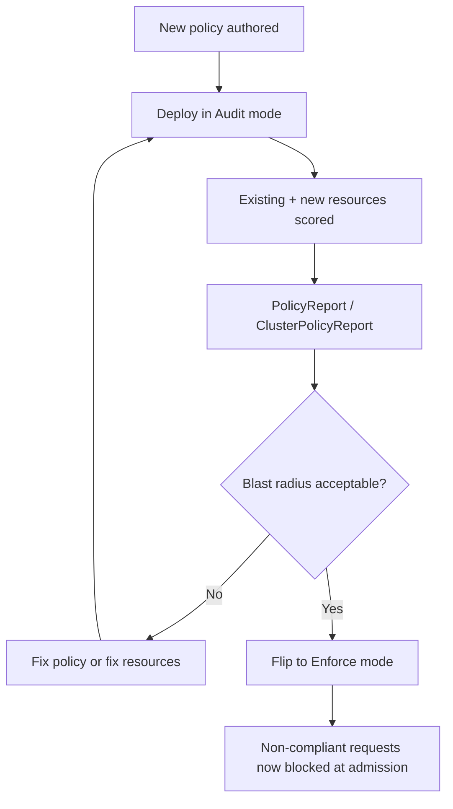

# Kyverno as a Dynamic Admission Controller: Enforce, Audit & Reports

<!-- astrona:playground -->
> [!NOTE]
> 🧪 **Hands-on playground for this module** — a clean, throwaway machine to explore on. No task, no grading. Folder: [`playground/`](https://github.com/astrona-io/ATS007/tree/main/sections/section-030/module-02/playground)
>
> ```sh
> astrona run --git ssh://git@github.com/astrona-io/ATS007.git -c sections/section-030/module-02/playground
> astrona destroy section-030-module-02-playground
> ```

Knowing that Kyverno *can* block a request is only half the picture. In production, flipping every new policy straight to "block" is how you take down a deploy pipeline the moment someone forgets one label. Kyverno's real operational model is built around a second mode — **Audit** — and a reporting system that lets you see the blast radius of a policy before it ever blocks anything.

This module covers that operational model: the difference between `Enforce` and `Audit`, the `PolicyReport`/`ClusterPolicyReport` objects that make Audit mode useful, the background scanning that catches resources which predate your policy, and the specific Kyverno controller processes responsible for each job.



## How this module is organised

1. **[Part 1 — Enforce vs Audit & PolicyReports](./course-01-enforce-vs-audit-and-policyreports.md)** — what each `validationFailureAction` setting actually does at admission time, the Audit-then-Enforce rollout sequence, and how to read a `PolicyReport` down to the individual failing resource.
2. **[Part 2 — Background Scanning & Controllers](./course-02-background-scanning-and-controllers.md)** — how `background: true` catches resources that existed before the policy did, and which of Kyverno's four controllers owns which job.

## Learning objectives

After this module you can:

- Explain the operational difference between `validationFailureAction: Audit` and `Enforce`, and when each is the right choice.
- Read `PolicyReport` and `ClusterPolicyReport` objects to find which resources are failing which policy rules.
- Explain what `background: true` does and why it matters for resources that existed before a policy was created.
- Explain why `Enforce` never remediates a resource that was admitted before the policy existed.
- Name Kyverno's four controllers (`kyverno-admission-controller`, `kyverno-background-controller`, `kyverno-reports-controller`, `kyverno-cleanup-controller`) and state which one is responsible for a given symptom.
- Describe the standard "roll out in Audit, review reports, flip to Enforce" operational pattern.

## Before you start

You should have completed Module 1 or otherwise be comfortable creating a `ClusterPolicy` with a `validate` rule. No prior exposure to `PolicyReport` objects is assumed.

The linked playground gives you a fresh **kind** Kubernetes cluster with Kyverno already installed and `kubectl` already pointed at it — there is no VM and no SSH step. It starts with **no policies** and one deliberately non-compliant Deployment already running in the `analytics` namespace, so the checkpoints in both parts land on a real pre-existing violation rather than a hypothetical one.
