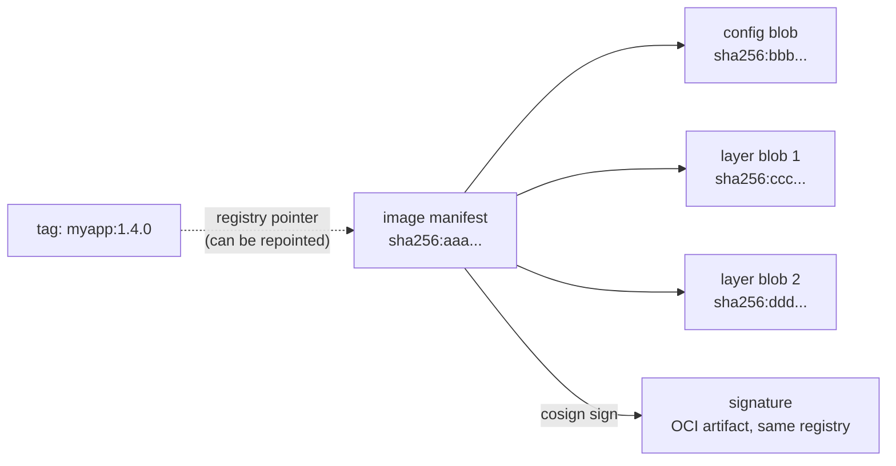

# OCI Image Fundamentals & Supply Chain Risk

<!-- astrona:playground -->
> [!NOTE]
> 🧪 **Hands-on playground for this module** — a clean, throwaway machine to explore on. No task, no grading. Folder: [`playground/`](https://github.com/astrona-io/ATS007/tree/main/sections/section-040/module-01/playground)
>
> ```sh
> astrona run --git ssh://git@github.com/astrona-io/ATS007.git -c sections/section-040/module-01/playground
> astrona destroy section-040-module-01-playground
> ```

When you write `image: myapp:1.4.0` in a Pod spec, it feels like you are naming a specific, fixed thing — the way a filename names a specific file. It is not. A tag is a label a registry maintainer can repoint to a completely different set of bytes at any moment, with no warning and no trace in your manifest. Everything a Kubernetes cluster can do to defend itself against a compromised or mislabeled image starts from understanding that one uncomfortable fact.

This module builds the vocabulary the rest of the section needs: what an OCI image actually is under the hood, why a digest is the only identity that can't move out from under you, and what signing and provenance attestations add on top of that identity.



## How this module is organised

1. **[Part 1 — OCI Manifests, Digests vs. Tags](./course-01-oci-manifests-digests-vs-tags.md)** — the manifest/config/layer object graph, why every part is content-addressed, and why a tag and a digest answer two completely different questions.
2. **[Part 2 — Signing & Provenance: Cosign and SLSA](./course-02-signing-and-provenance-cosign-and-slsa.md)** — what a Cosign signature proves (and doesn't), keyed vs. keyless signing, and what an attestation adds beyond a bare signature.

## Learning objectives

After this module you can:

- Describe the OCI image object graph (manifest, config blob, layer blobs) and explain why each is identified by a `sha256` digest.
- Explain the difference between a tag reference and a digest reference, and why only a digest is immutable.
- Resolve the digest a running Pod actually pulled, independent of the tag written in its spec.
- Explain what a Cosign signature proves about an image, and why a signature alone does not prove anything about *how* the image was built.
- Describe the difference between keyed and keyless Cosign signing.

## Before you start

You should be comfortable with basic `kubectl` usage (`get`, `describe`, `apply`) from earlier sections of this curriculum. No prior container-registry or cryptography experience is assumed.

The linked playground gives you a kind Kubernetes cluster with `kubectl` already pointed at it — there is no VM and no SSH step. Kyverno is installed, the `crane` registry client is on your `PATH`, and a sample `edge-api` Deployment is already running in the `edge` namespace from the mutable tag `docker.io/library/nginx:1.25-alpine`. Every command block in the parts runs in that cluster.

All command output in this chapter is representative. **Digests in particular will not match what you see** — they depend on which image the registry is serving at the moment you run the command.

## Three questions this module answers

The whole subject collapses into three questions you can ask about any image reference. Part 1 settles the first two; Part 2 takes the third:

1. **What is an image, physically?** Not one file — a small graph of separately-stored, content-addressed objects.
2. **What did I actually get?** The tag you wrote and the bytes you received are different facts, and only one of them is stable.
3. **Who vouched for it, and for what?** A signature answers a narrower question than most people assume.

## Where this fits

Everything in this module is groundwork for a single decision made elsewhere: whether the cluster should admit a given Pod. Module 2 turns these ideas into an enforced `verifyImages` policy, where the digest becomes the thing signatures are checked against and the thing the admitted Pod gets rewritten to. Reading digests and signatures correctly here is what makes that policy meaningful rather than cargo-culted — a `verifyImages` rule whose author does not understand why `mutateDigest` matters is a rule that can be disabled by someone who understands it slightly better.
