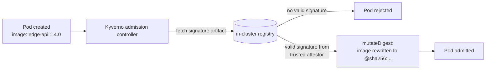

# Verifying Images with Kyverno verifyImages

<!-- astrona:playground -->
> [!NOTE]
> 🧪 **Hands-on playground for this module** — a clean, throwaway machine to explore on. No task, no grading. Folder: [`playground/`](https://github.com/astrona-io/ATS007/tree/main/sections/section-040/module-02/playground)
>
> ```sh
> astrona run --git ssh://git@github.com/astrona-io/ATS007.git -c sections/section-040/module-02/playground
> astrona destroy section-040-module-02-playground
> ```

Everything up to this point — signatures, digests, attestations — is inert without something in the admission path actually checking them. `verifyImages` is Kyverno's fourth rule action (alongside `validate`, `mutate`, and `generate`): a rule type dedicated entirely to intercepting Pod admission, fetching the signature and attestation artifacts for every referenced image, and refusing the Pod if they don't check out.

This module writes that policy for real: a `verifyImages` rule that requires a trusted Cosign signature for anything running in the `edge` namespace, and that rewrites an approved image's reference to its verified digest before it's ever persisted.



## How this module is organised

1. **[Part 1 — verifyImages Rule Anatomy & Attestors](./course-01-verifyimages-rule-anatomy-and-attestors.md)** — `imageReferences`, `attestors`, `required`, and how a keyed public key is wired into the rule.
2. **[Part 2 — mutateDigest & Required Attestations](./course-02-mutatedigest-and-required-attestations.md)** — closing the tag-mutation gap with `mutateDigest: true`, and requiring in-toto/SLSA attestation predicates on top of a bare signature.

## Learning objectives

After this module you can:

- Write a `verifyImages` ClusterPolicy that requires a trusted signature for images matching a glob pattern.
- Configure a keyed attestor from a PEM public key.
- Explain what `required: true` does when an image has no signature at all.
- Enable `mutateDigest: true` and explain what problem it solves.
- Explain, at a conceptual level, how an `attestations` block lets a rule require more than a bare signature.

## Before you start

Complete Module 1 first — this module assumes you already understand digests, tags, and what a Cosign signature proves.

The linked playground gives you a kind Kubernetes cluster with `kubectl` already pointed at it — there is no VM and no SSH step. Kyverno is installed, `crane` and `cosign` are on your `PATH`, and an in-cluster registry at `registry.registry-system.svc.cluster.local:5000` holds two images built from the same base:

- `edge-api:1.4.0` — **signed** with the playground's Cosign key.
- `edge-api:1.4.0-untrusted` — **unsigned**.

The matching public key is published as `configmap/cosign-pubkey` in the `edge` namespace and left at `/tmp/cosign.pub`. No `verifyImages` policy exists yet — writing one is the point.

All command output shown in the parts is representative; **digests will differ from what is printed here**.

## Where this fits

`verifyImages` is the only rule action in this curriculum that makes an outbound network call during admission. A `validate` rule reasons purely about the object in front of it; a `verifyImages` rule has to reach the registry, fetch signature artifacts, and check cryptography before it can answer — which puts registry reachability and key management on the critical path of every matching Pod creation, cluster-wide. That is a meaningful operational commitment, and it is the reason this module spends as much time on failure modes as on syntax.
